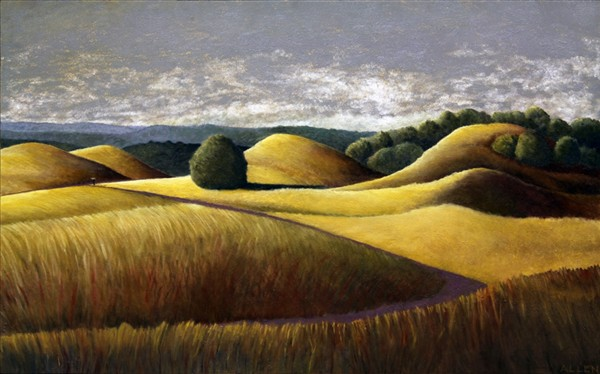

+---
+layout: post
+title: "A Neural Network Art Forger of my Very Own"
+date: 2016-06-25
+---

Having grown up in Washington, I think of the state as one of the most varied and beautiful in terms of landscape. I might also get this opinion from my father, an architect and artist who grew up in the eastern part of the state, and has lived in Washington for most of his life. My father started doing art inspired by his home when I was still in grade school, and has developed a distinct style of landscape painting.

When I got my first neural network running locally (using Torch and DeepStyle/neural-style described [here](https://github.com/jcjohnson/neural-style)), I immediately wanted to use my dad's artworks to inform the network's filters, and to manipulate some actual photos of western landscapes that I myself have taken over the years.

I chose to start here, with a shot from eastern Washington state. This landscape is typical of my dad's artwork; in my preliminary research and experiments with DeepStyle, I found that similar compositions with semi-matching areas of light and dark led to better results and less visual confusion as the network renders features like horizon and foreground. More on that later.

  

I chose to modify this photo on the right with information generated from this piece on the left, called Summer Light: The Back Road to Neil's Place. There are a number of visual similarities between the two, such as rolling yellowish hillsides, green plants in the midground, clouds in a grey-ish sky, and a dark green horizon line.

Now, the default setup for DeepStyle includes 1,000 iterations, meaning that the network is refining the output 1,000 times before it thinks it is done. It gives you a sneak peek as it is doing so by saving the output every 100 iterations. So, the first image I got to see after giving it the two images above was:

![Summer Light x Ekone at 100 iterations] (/img/Ekone%20to%20Summer%20Light%20out_100.png)

Well, that isn't super attractive. It looks like a bad photoshop filter, and the color seems pretty off. Let's hope it gets better!

